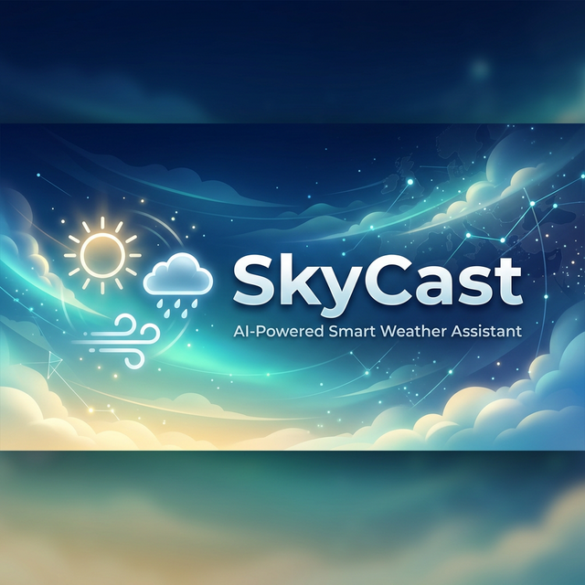

# 🌤️ SkyCast: AI-Powered Smart Weather Assistant



<div align="center">
  <h3>Next-Generation Weather Insights for Modern Android</h3>
  
  <p align="center">
    <a href="https://kotlinlang.org/"></a>
    <a href="https://developer.android.com/jetpack/compose"></a>
    <a href="https://ai.google.dev/"></a>
    <a href="https://developer.android.com/topic/architecture"></a>
  </p>
</div>

---

## 📖 Overview
**SkyCast** is a premium meteorological companion that goes far beyond traditional weather apps. Built with a focus on high-fidelity UI and intelligent automation, SkyCast leverages **Google's Gemini AI SDK** to provide personalized, conversational weather briefings tailored to your local context.

Whether you need a quick morning summary of what to wear or precise custom alerts for changing conditions, SkyCast delivers high-quality data through a stunning, glassmorphic interface designed for both performance and delight.

---

## ✨ Key Features

### 🤖 Intelligent AI Weather Personalities
* **Dynamic Briefings**: Get summarized weather insights including outfit suggestions and commute advice using `gemini-flash`.
* **Adaptive Greetings**: The AI greets you naturally based on the current time of day—Good morning, Good afternoon, or Good evening.
* **Localized Reasoning**: AI prompts and responses respect your language preference (English/Arabic).

### 🚨 Smart Condition Alerts
* **Precision Monitoring**: Set custom triggers for temperature drops, rain probability, or wind speed shifts.
* **Background Reliability**: Powered by `WorkManager`, SkyCast monitors conditions silently and notifies you only when it matters.
* **Daily Digest**: Optional Morning Brief notifications to start your day informed.

### 🍱 Premium UI & Experience
* **Glassmorphic Design**: A modern aesthetic featuring smooth blurs, vibrant gradients, and elegant typography.
* **Full RTL & Localization**: Seamless support for Arabic (RTL) and English layouts.
* **Interactive Maps**: Select your location via a high-performance Google Maps integration.
* **Home Screen Widgets**: Stay updated at a glance with beautiful `Jetpack Glance` widgets.

### 🏗️ Robust Engineering
* **Single Source of Truth**: Persistent caching via `Room Database` ensures a reliable offline experience.
* **Unit Flexibility**: Effortlessly switch between Celsius/Fahrenheit and Metric/Imperial units with synchronized math.
* **Manual Dependency Injection**: A clean `AppContainer` pattern for lean, maintainable, and testable code.

---

## 🛠️ Technology Stack
* **Language**: [Kotlin](https://kotlinlang.org/)
* **UI**: [Jetpack Compose](https://developer.android.com/jetpack/compose) with Material Design 3
* **Concurrency**: [Coroutines](https://kotlinlang.org/docs/coroutines-overview.html) & [Flow](https://kotlinlang.org/docs/flow.html)
* **Networking**: [Retrofit](https://square.github.io/retrofit/) + [OkHttp](https://square.github.io/okhttp/)
* **Local Database**: [Room](https://developer.android.com/training/data-storage/room)
* **Persistence**: [DataStore](https://developer.android.com/topic/libraries/architecture/datastore)
* **Background Tasks**: [WorkManager](https://developer.android.com/topic/libraries/architecture/workmanager)
* **AI Engine**: [Google Generative AI SDK (Gemini)](https://ai.google.dev/)
* **Maps**: [Google Maps Compose](https://github.com/googlemaps/android-maps-compose)
* **Testing**: [MockK](https://mockk.io/), [Turbine](https://github.com/cashapp/turbine), JUnit4

---

## 🚀 Getting Started

### Prerequisites
- JDK 17+
- Android Studio Iguana+ (2023.2.1+)
- [OpenWeatherMap API Key](https://openweathermap.org/api)
- [Google Gemini API Key](https://aistudio.google.com/)

### Installation
1. Clone the repository:
   ```bash
   git clone https://github.com/UserName/SkyCast.git
   ```
2. Navigate to your `local.properties` file in the project root and add your keys:
   ```properties
   WEATHER_API_KEY="your_api_key_here"
   GEMINI_API_KEY="your_gemini_key_here"
   MAPS_API_KEY="your_maps_key_here"
   ```
3. Build and run the app on your device or emulator.

---

## 📁 Project Structure
The codebase follows a clear separation of concerns:
```text
com.example.skycast
│
├── data/                  # 🗄️ Data Layer
│   ├── local/             # Room DB, DAOs, Entities
│   ├── remote/            # Retrofit, API Services, DTOs
│   ├── repository/        # Repository implementations
│   └── service/           # WorkManager Workers
│
├── ui/                    # 📱 Presentation Layer
│   ├── home/              # Main Weather & AI Brief UI
│   ├── alerts/            # Custom Weather Alerts
│   ├── favorites/         # Favorite Locations Management
│   ├── settings/          # App Preferences
│   ├── splash/            # Animated Splash Screen
│   └── theme/             # Styling & Design System
│
├── di/                    # 💉 Dependency Injection (AppContainer)
└── utils/                 # ⚙️ Core Utilities
```

---

## 🏛️ Architecture
The project follows **Clean Architecture** principles:
- **Presentation (UI)**: Jetpack Compose screens and ViewModels.
- **Data (Infrastructure)**: Retrofit services, Room DAOs, and repository implementations.
- **Service (Worker)**: Background workers for notifications and AI processing.

---

## 📄 License
This project is licensed under the MIT License - see the [LICENSE](LICENSE) file for details.

---

<div align="center">
  Built with ❤️ by the SkyCast Team
</div>
